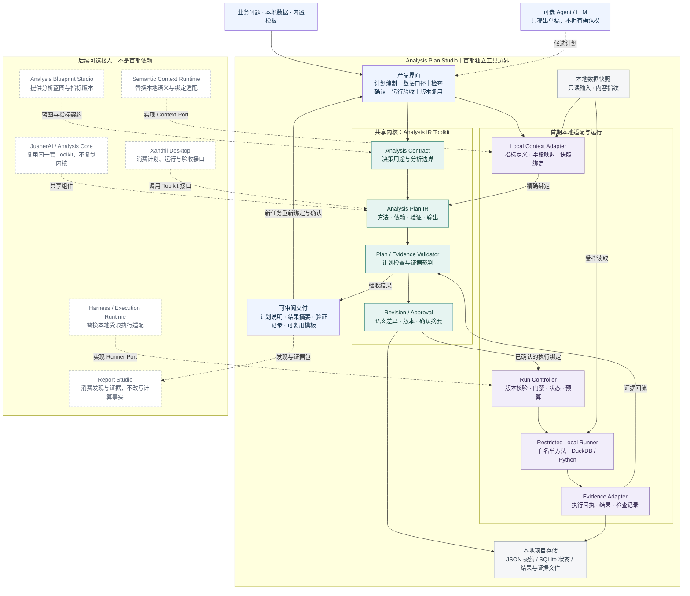

# Analysis Plan Studio：分析计划与验证工具
## 独立产品方案 v1.0

> **产品定位：先确认 AI 准备怎么分析，再检查它实际做了什么，并把这套方法留给下一次复用。**
>
> 产品名称暂定为 **Analysis Plan Studio**；共享技术组件称为 **Analysis IR Toolkit**。
> 本方案以独立运行、独立验收为首期目标，成熟后作为共享能力接入 JuanerAI；不是 JuanerAI 全平台方案，也不是第二个 Xanthil。

| 文档项 | 内容 |
|---|---|
| 版本 / 日期 | v1.0 / 2026-09-30 |
| 文档性质 | 产品与工程规划基线；不代表下述能力已经实现或验证 |
| 服务对象 | 数据驱动决策者、业务分析与决策人员，以及为其提供分析服务的专业分析师 |
| 首期场景 | 销售差异与多维贡献拆解：一个可计算、可核对、可复用的分析闭环 |
| 首期运行形态 | macOS 本机运行的轻量工具；本地界面、本地项目、本地受限计算，无需部署 JuanerAI |
| 首期交付核心 | 可读计划、结构化 IR、显式确认、受限执行、证据验收、模板复用 |
| 不作为首期依赖 | Xanthil Desktop、完整 Analysis Core/DAME、Semantic Context Runtime、Semantica、Domain Pack、OSM、Model Pack、双库及企业权限体系 |

**阅读顺序：**产品负责人先看第 1—6、13—15 节；架构与开发负责人重点看第 7—12 节及附录；质量负责人以第 14 节验收矩阵为基线。架构图及可编辑 Mermaid 定义见第 3 节。

---

## 1. 产品决策与建设原则

### 1.1 本次要做什么

建设一个围绕"一次分析的计划与验收"工作的独立小工具。用户可以从业务问题、内置模板或已有方案出发，编制分析计划；工具明确指标、数据、方法、证据与验证要求；用户确认后，由受支持的执行器完成分析，再按原约定检查结果。

产品的业务闭环为：**提出问题 → 明确约定 → 检查并确认 → 受限执行 → 证据验收 → 保存与复用。**

工具面向用户展示的是计划卡片、待确认问题、变更差异和结果证据，而不是要求用户直接编辑 JSON。机器执行对象与用户阅读对象必须来自同一份正式计划，不能分别生成两套彼此可能不一致的说明。

### 1.2 三层定位

| 层次 | 名称 | 负责什么 | 不负责什么 |
|---|---|---|---|
| 产品外壳 | Analysis Plan Studio | 人机交互、计划编审、版本查看、运行验收、模板管理 | 不建设完整数据分析工作台或通用 Agent 平台 |
| 共享内核 | Analysis IR Toolkit | IR 契约、计划构建与检查、版本差异、执行交接契约、证据验收规则 | 不直接承担企业语义服务、任意代码执行或业务决策执行 |
| 本地参考适配 | Local Context / Runner / Evidence / Store Adapters | 在没有 JuanerAI 时提供最小数据绑定、受限计算、证据回收和存储实现 | 不复制完整 Semantic Context Runtime、Harness 或企业数据平台 |

**IR 是结构化数据对象，不是 Agent，也不是运行时。**规划组件或人产生候选计划，检查器检查，执行器执行，验证器裁判。将它们封装成一个工具，不等于取消职责边界。

### 1.3 六条建设约束

1. **独立闭环，而非平台前置。**安装工具、导入本地数据、选择内置模板，即可完成首期验收；不要求任何 JuanerAI 服务在线。
2. **先限制方法，再扩大能力。**首期只执行受支持、版本锁定的内置方法，不默认接受任意 SQL/Python。
3. **先让人看懂，再让机器运行。**未解决的指标、数据或方法歧义必须显示；不由模型静默补齐为正式事实。
4. **先落实门禁，再宣传受控。**写在提示词中的要求不等于执行约束；只有适配器实际强制落实的检查才标记为已执行。
5. **一份规范，多处消费。**今后独立工具与 JuanerAI 复用同一份契约及核心实现，不维护两套分析方法论。
6. **输出证据，不代替经营决定。**工具交付分析发现、限制与后续待验证问题，不自动批准降价、发券或调整分货。

### 1.4 技术独立与商业独立分开判断

本方案决定先验证"独立组件"和"可独立使用的工具"，不预设它必须成为另一个单独收费、单独获客的品牌。优先在实际 coding-agent 分析流程中验证价值，再决定以独立工具、Xanthil 内嵌功能或开发者组件的形式分发。

---

## 2. 用户问题、产品价值与范围

### 2.1 需要解决的问题

以下为本方案要验证的产品假设，并非已经获得量化证明的市场结论。

| 分析环节 | 当前可能出现的问题 | 本工具的处理方式 |
|---|---|---|
| 分析前 | 一句需求直接进入代码生成，口径和方法分歧没有提前显露 | 先生成可读的分析约定，并列出必须确认的未知项 |
| 分析中 | Agent 改样本、换指标、删异常值，却没有形成明确变更 | 显示语义级差异，生成新版本，按影响重新确认 |
| 分析后 | 报告看起来完整，但不清楚约定的步骤与检查是否完成 | 按步骤核对执行回执、验证记录、证据与限制 |
| 再次分析 | 复用的是提示词或旧报告，连同旧口径和旧结论一起复制 | 复用参数化方法，重新绑定数据、重新确认并重新验证 |
| 人机协作 | 不会审代码的人难以判断 Agent 是否做对了约定事项 | 提供可审阅的行为契约，以及能定位到证据的验收结果 |

### 2.2 首期用户与任务

第一类用户是已经使用 Agent、SQL 或 Python 做分析的分析人员；他们需要控制分析范围并提高复用性。第二类用户是需要审查分析计划与结果的业务负责人；他们不需要理解 IR 语法，但应能判断比较对象、指标口径和结论限制是否合理。

首期由单人完成编制、确认和验收。不同动作仍需留下操作者、时间和版本记录，但不把双人审批、部门权限或企业身份系统设为前置条件。

### 2.3 首期正式范围

| 模块 | 首期必须交付 | 明确后置 |
|---|---|---|
| 计划编制 | 结构化表单、一个场景模板、可读计划；可选 Agent 草稿导入 | 通用方法自动发现、复杂多 Agent 规划 |
| 数据与语义 | 本地 CSV/Parquet、字段映射、指标契约、数据快照 | 企业数据目录、任意数据库连接、完整本体服务 |
| 计划检查 | Schema、引用、依赖、指标/数据绑定、方法能力与规则检查 | 自动证明任意业务逻辑正确 |
| 变更治理 | 草稿、确认版本、差异、重新确认、运行前一致性检查 | 复杂企业审批流、跨部门授权委派 |
| 执行 | 一套受限本地 Runner、固定方法、超时取消、执行回执 | 任意生成代码、远程分布式计算、外部 Agent 强控制 |
| 验收 | 数据检查、数值对账、证据覆盖、限制提示、人工接受/退回 | 自动因果判断、自动经营执行 |
| 输出与复用 | 计划说明、结果表、验证摘要、证据包、参数化模板 | 精美 PPT/DOCX 编排、完整 Report Studio |

自然语言起草属于可选增强。**离线、无模型账户的"模板 + 表单 + 本地执行"路径必须可用**，不能把外部 LLM 可用性设为独立验收的条件。

---

## 3. 产品工具架构图

图中实线为首期内部工作链路；虚线为可选候选计划输入或后续平台接入。右侧平台能力不属于首期运行依赖。可编辑源文件与本文配套提供。


配套提供同一架构的 PNG 预览、可编辑 SVG 矢量图与 Mermaid 源代码。下方 Mermaid 保留更详细的模块交接关系。

<!-- ARCHITECTURE_START -->

<!-- ARCHITECTURE_END -->

### 3.1 图中容易混淆的三点

**分析逻辑与执行控制分离。**Toolkit 确定方法要求和验证规则；Run Controller 执行状态管理、版本核验、资源预算与门禁；Runner 执行计算。Runner 无权自行放宽规则。

**验证规则与验证运行分离。**Validator 定义检查逻辑并汇总裁判结果；需要扫描数据的检查由受限方法执行，回传结构化记录。只有检查记录对应本次计划和数据，才进入本次验收。

**存储通过接口使用。**图中的 SQLite、JSON 和文件目录是本地参考实现，不是未来平台必须继承的固定物理存储。Toolkit 不直接绑定独立工具的窗口、桌面进程或数据库连接。

---

## 4. 首期场景：销售差异与多维贡献拆解

### 4.1 输入问题与任务收敛

用户输入："最近门店销售下降，分析原因，判断是否需要全面降价。"

工具先把任务收敛为："在确认销售口径与比较范围后，计算整体变化，识别不同门店、品类对应的数值贡献；列出尚不能验证的解释。"

"是否全面降价"保留为决策用途，但首期不把销售分解结果直接等同于降价依据。若要证明价格调整的效果，需要另立具备相应证据和方法的分析任务。

### 4.2 数据与指标契约

建议首期支持一个已经整理好的事实表，而不是同时承担复杂数据清洗和多表建模。最小字段如下：

| 字段 | 约定 | 缺失或异常处理 |
|---|---|---|
| `row_id` | 唯一行标识，用于重复检查 | 缺失或重复为阻断项；不可静默去重 |
| `business_date` | 明确业务日期口径与时区；不从文件名猜测 | 无法解析或口径未知时阻断 |
| `store_id` | 稳定的门店标识 | 缺失阻断；标签变更不能制造"新门店" |
| `category_id` | 互斥的品类归属 | 可按明确规则进入"未知品类"，必须保留并披露 |
| `net_sales_amount` | 本币净销售额，明确税、优惠、退款及退款归属周期 | 口径未确认阻断；负数不自动视为错误 |
| `currency` 或项目货币配置 | 同一可加总货币 | 混合货币且无明确换算契约时阻断 |
| `coverage_manifest` | 期间数据完整性声明，或可核验的数据覆盖清单 | 无覆盖证明时不得把"没有记录"直接当作零销售 |

同店分析不是简单取两个期间中"有销售记录的门店交集"。使用同店口径时，必须提供可确认的门店资格清单及其规则，例如完整营业状态、统计覆盖范围；首期允许用户导入或确认这份清单。没有资格依据时，应改为明确标注的全量观察范围，不能包装成同店分析。

### 4.3 固定分析步骤

| 步骤 | 处理 | 必需证据 |
|---|---|---|
| S01 数据质量检查 | 类型、行唯一性、关键字段、覆盖范围、币种 | 检查记录、异常数量、适用处理规则 |
| S02 构建比较范围 | 两个期间、门店资格、过滤规则、未知维度处理 | 范围清单、过滤前后行数与金额 |
| S03 整体差异 | 基期、报告期、变化额、变化率 | 两期汇总表、口径引用 |
| S04 按门店拆解 | 每店两期金额及变化；对账回整体 | 门店贡献表、对账记录 |
| S05 按品类拆解 | 每类两期金额及变化；对账回整体 | 品类贡献表、对账记录 |
| S06 验证与交付 | 对账、覆盖、结论资格、限制清单 | 验证摘要、发现卡片、证据引用 |

门店和品类是对同一整体差异的**两种独立切片**，不能把二者的贡献重复相加。只有在数据粒度、归属与覆盖检查通过后，才允许在各自切片内部求和。

### 4.4 数值规则与解释边界

对同一口径下的两期金额，定义：

```text
变化额 Δ = 抔告期金额 − 基期金额
变化率 r = Δ / 基期金额，仅当基期金额 > 0 时按普通增长率展示
分组变化额 Δg = 报告期分组金额 − 基期分组金额
加总检查：各组分 Δg 之和 = 整体 Δ，按明确的金额精度规则比较
```

基期为零或负数时，不输出普通增长率，而显示绝对变化及原因。总变化接近零时，不用 `Δg / Δ` 排名，避免极端或难以解释的比例；优先展示变化额。需要展示有符号贡献比时，允许其为负或超过 100%，不能强制截断为 0—100%。

计算使用明确的货币精度与舍入阶段；同币种、定点金额的对账应优先精确比较，不能用过大的容差掩盖错误。

### 4.5 示例结果：仅为说明产品行为的合成数据

| 品类 | 基期净销售额 | 报告期净销售额 | 变化额 |
|---|---:|---:|---:|
| 女装 | 500,000 | 380,000 | -120,000 |
| 男装 | 300,000 | 270,000 | -30,000 |
| 配饰 | 200,000 | 220,000 | +20,000 |
| 合计 | 1,000,000 | 870,000 | -130,000 |

可以输出的描述是："在本任务确认的范围与口径下，净销售额下降 130,000，变化率为 -13%；女装的负向变化额最大，配饰的正向变化部分抵消了下降。"

不能自动输出："价格过高导致下降""库存不足是主要原因"或"全面降价可提升销售"。没有相应证据的解释进入"待验证问题"，不是已证实结论。

### 4.6 预期交付

一次成功任务至少生成：计划说明、两期汇总表、门店贡献表、品类贡献表、数据/数值检查记录、带证据引用的发现卡片、限制清单，以及本次运行的版本与数据指纹。

工具输出的 Markdown 分析摘要属于结果验收材料，不承担精美报告编排。后续可将发现与证据交给 Report Studio。

---

## 5. 用户流程与界面

### 5.1 五个主要页面

| 页面 | 用户主要操作 | 关键展示 | 完成条件 |
|---|---|---|---|
| 项目与模板 | 新建项目、选模板、查看历史 | 最近计划、运行状态、模板适用边界 | 建立独立项目与任务 |
| 分析计划 | 填写目的、范围、方法与输出；处理草稿歧义 | 业务版计划卡片、假设/待验证问题、未解决项 | 可审阅计划形成 |
| 数据与口径 | 选择本地文件、映射字段、确认指标和快照 | 类型、粒度、覆盖、映射来源、口径版本 | 必需绑定完成 |
| 检查与确认 | 查看问题、比较版本、确认正式计划 | 阻断项、警告、实质变更、执行权限摘要 | 形成明确确认记录 |
| 运行与验收 | 启动/取消、检查证据、接受/退回、保存模板 | 步骤状态、验证结果、发现与限制、证据跳转 | 形成验收记录或明确失败原因 |

JSON/IR 视图为高级检查入口，不是普通用户的默认界面。第一版不做拖拽式流程画布，避免把分析计划产品变成通用编排平台。

### 5.2 分析前：草稿不等于承诺

用户选模板后，工具生成候选步骤及其所需字段。对于"最近""销售额""同店"等不明确表达，只能提出候选解释；没有确认来源的内容统一进入"待确认"。

允许用户在没有数据时编写计划，但必须显示"未绑定/不可执行"。缺少字段时可以保存草稿，不可以进入已确认的可执行状态。

### 5.3 分析中：变更必须留痕

当用户或 Agent 提议换比较期间、修改退款口径、剔除订单、调整分组或改变方法时，先生成 `ChangeRequest`，展示旧值、新值、原因及影响范围。

首期采用保守规则：任何影响范围、方法、数据、验证或执行权限的变更都产生新版本并重新确认；不建设复杂的自动局部影响分析。原运行停止或保留原快照继续，绝不在同一运行中悄悄换计划。

仅修改展示标题或备注时，写入独立注释记录，不改写已经确认的执行对象。

### 5.4 分析后：接受结果不等于批准经营动作

结果页分别展示"运行是否完成""验证是否通过""分析结果是否被用户接受"。三者不能合并为一个绿色成功标记。

用户可将结果标记为接受、带限制接受或退回。任何阻断性验证未通过时，不允许标记为完整接受；允许保存或导出未验收证据，但必须保留未通过状态。警告可以人工确认，失败检查不能被改写为通过。

### 5.5 复用：复制方法，不复制结论资格

保存模板时提取问题框架、方法步骤、参数、验证规则和输出要求，清除原数据快照、运行编号、结果数值、审批状态与已验证结论。

下次任务重新填写参数、重新绑定数据、检查兼容性并确认。对相同数据进行复跑也创建新的 `run_id`，不能覆盖旧运行记录。

---

## 6. 功能需求清单

| 编号 | 功能要求 | 优先级 | 可验收输出 |
|---|---|---|---|
| F01 | 以模板和表单创建候选计划；支持保存未完成草稿 | P0 | 计划 JSON 与同源可读视图 |
| F02 | 导入、校验本地事实表和覆盖清单；生成快照指纹 | P0 | 数据清单、字段映射、快照版本 |
| F03 | 显式维护指标口径、分组规则与比较范围 | P0 | 版本化指标/范围契约 |
| F04 | 检查结构、引用、依赖、绑定及方法能力 | P0 | 可定位到字段/步骤的检查结果 |
| F05 | 确认计划，并对执行绑定内容生成摘要 | P0 | 独立确认记录，不靠对话文字推断 |
| F06 | 展示实质变更，旧确认不能授权新内容 | P0 | 版本差异、失效原因、重新确认记录 |
| F07 | 通过固定本地方法完成销售差异闭环 | P0 | 六步运行记录及标准结果表 |
| F08 | 超时、取消、失败时停止后续依赖步骤 | P0 | 明确的终止状态和保留的部分证据 |
| F09 | 对账、覆盖、证据完整性检查；人工验收 | P0 | 分项验证状态与最终验收记录 |
| F10 | 导出计划、结果、验证和证据；保留版本关联 | P0 | 可离线审阅的分析交付包 |
| F11 | 保存模板、创建下一周期任务、重新验证 | P0 | 参数化模板与第二次独立运行 |
| F12 | Agent 结构化草稿导入，不执行其中夹带的代码 | P0-轻量 | 草稿导入记录与问题清单 |
| F13 | 可选 LLM 自然语言起草和解释 | P1 | 外发内容预览、明确授权、草稿来源 |
| F14 | 外部 Runner 回执接入与一致性测试 | P1 | 能力声明、证据级别及适配器测试报告 |
| F15 | JuanerAI、Xanthil 及其他模块对接 | P2 | 使用同一规范与核心实现的集成测试 |

P0-轻量不要求首期开发特定商业 Agent 的原生插件；标准 JSON 草稿导入已经满足这一要求。自然语言粘贴可作为备注保存，不自动变成可执行计划。

---

## 7. 核心对象与 IR 契约

### 7.1 对象分工：不把所有内容塞进一个可变 JSON

| 对象 | 核心内容 | 生命周期与权威 |
|---|---|---|
| `AnalysisContract` | 为什么分析、支持什么决策、问题边界、非目标、成功标准 | 用户确认的业务约定；IR 引用其精确版本 |
| `MetricContract` | 指标公式、单位、粒度、时间/退款/过滤口径 | 本地登记或外部导入的版本化定义 |
| `BindingSnapshot` | 业务概念到表字段、维度和指标的绑定 | 本地 Context Adapter 产生；用户可审查 |
| `DataSnapshotManifest` | 输入快照、内容指纹、解析配置、覆盖清单 | 本地数据层生成；不同数据不得冒用同一快照 |
| `AnalysisPlanIR` | 方法步骤、依赖、参数、验证要求、输出契约 | 正式分析计划；不混入运行结果 |
| `ExecutionManifest` | 后端、方法实现版本、输入绑定、权限、预算、输出位置 | 本地编译/绑定产生；与计划一同进入确认摘要 |
| `Approval` | 确认人、时间、批准内容摘要、警告确认、有效范围 | 独立记录；模型不能自行创建有效确认 |
| `RunRecord` | 运行编号、绑定摘要、步骤状态、时间、错误与终止原因 | 每次运行独立；重试不覆盖历史 |
| `EvidenceBundle` | 结果文件、校验摘要、检查记录、来源和依赖关系 | 与本次运行绑定；后续发现只能引用对应证据 |
| `Finding` / `ReviewRecord` | 发现、证据引用、资格与限制；人的接受/退回记录 | 发现可修订，数值与证据不得静默改写 |
| `PlanTemplate` | 可复用的方法、参数槽位、适用条件和验证规则 | 不包含旧任务的有效批准或已验证结论 |
| `ChangeRequest` | 变更原因、旧值/新值、影响对象与处理结果 | 人或 Agent 均可提议；正式合入受确认门禁约束 |

每个对象都有稳定 ID 和独立版本。IR 只引用已声明的契约/资产；同一指标公式、数据范围或规则不得在多个对象中出现互相冲突的权威副本。

### 7.2 IR 的最低表达能力

首期 IR 至少表达下列内容：

| 字段组 | 必需信息 | 检查规则 |
|---|---|---|
| 身份与兼容性 | `schema_version`、`plan_id`、`plan_version` | 不接受未知主版本；禁止隐式升级 |
| 业务约定 | `contract_ref`、问题与输出的对应关系 | 引用必须存在且版本固定 |
| 语义与数据 | `binding_ref`、`dataset_refs`、`metric_refs` | 不允许 `latest` 或执行时再猜字段 |
| 方法步骤 | `step_id`、`method_ref`、参数、输入/输出、依赖 | ID 唯一、依赖无环、引用完整、方法受支持 |
| 验证要求 | `check_id`、规则版本、检查对象、触发阶段、失败动作 | 必需检查没有实现或结果未知时阻断 |
| 输出要求 | 结果表、发现类型、证据要求、限制披露 | 每个数值发现必须有对应证据 |
| 结论资格 | 描述/数值分解/其他允许类型，禁止类型 | 首期不允许自动发布因果或干预效果结论 |
| 执行约束 | 允许的适配器能力、资源与权限策略引用 | 与后端能力不兼容时不得降级偷偷执行 |

JSON Schema Draft 2020-12 可作为结构约束规范的选定基线；它提供对象结构、必需字段和类型等验证所需的规范基础。[R1] **业务语义、跨文件引用、步骤依赖和证据充分性必须由额外规则检查，不能把 Schema 合法称为"分析正确"。**

对格式字段也应明确校验实现：该规范区分 `format` 注解与断言词汇，不能默认认为写了日期格式就已经执行了强校验。[R1] 工程验收必须用错误日期、未知枚举、额外字段和错误引用做真实测试。

### 7.3 确认的对象不是一句"同意"，而是一组精确绑定

建议首期批准摘要覆盖以下内容：

```text
approval_target = {
  analysis_contract_version_and_digest,
  analysis_plan_version_and_digest,
  metric_and_binding_versions_and_digests,
  data_snapshot_manifest_digest,
  method_and_check_registry_versions_and_digests,
  execution_manifest_digest
}
```

摘要计算采用固定、版本化的规范化规则，明确对象键序、数值与日期表示、字符串编码及排除字段，并配套跨语言测试向量。不能对任意 JSON 字符串直接哈希后就宣称逻辑等价对象必然得到同一结果。

确认记录保存在上述对象之外，避免把确认摘要本身纳入其摘要形成循环。运行状态、时间戳和展示备注不写回已确认计划。

**首期保守规则：**上述任一有效内容变化，新内容不得使用旧确认启动；先重新检查，再重新确认。未来可以研究兼容性判断，但不能首期就用"差不多没变"替代精确绑定。

内容指纹用于识别变化和关联证据，不等于防篡改审计系统。拥有本机文件完整修改权限的人仍可能改动记录；企业级签名、受信任时间戳和独立审计服务不属于首期承诺。

### 7.4 数据快照与复现

首期默认把用户明确选择的数据复制为项目快照，再对实际使用的快照计算指纹；业务计算不持续读取可能被外部程序修改的原文件。CSV 解析配置、列类型、货币精度、时区和覆盖清单也纳入快照/执行绑定。

启动前核验快照；执行中使用固定快照；完成后记录实际读取的快照及其指纹。输入变化、解析失败或完整性核验失败时停止，不输出完整通过的结果。

计划、数据、方法实现与运行环境相同是本工具要求的复现条件。首期固定聚合方法应保证数值对账稳定；对结果行顺序显式排序，避免把无序输出误判为差异。自然语言解释不属于数值复现的权威结果。

### 7.5 首期不做通用分析语言

首期是"有限方法集合上的分析计划契约"，不是可以自动编译一切分析需求的通用语言。一个方法条目至少声明输入、参数类型、适用条件、输出、检查规则和实现版本。

超出方法集合的步骤显示 `UNSUPPORTED_METHOD`，可以留在草稿中，不允许临时拼接自由代码后继续宣称受控运行。扩展方法必须先补方法契约、参考结果和失败测试，再开放给正式计划使用。

---

## 8. 验证门禁、状态与变更

### 8.1 五道门禁

| 门禁 | 时机 | 检查内容 | 失败动作 | 责任组件 |
|---|---|---|---|---|
| G0 计划完整性 | 草稿进入审查前 | 结构、必填项、引用、依赖、参数、已支持方法 | 保留草稿，定位问题；不可确认 | Plan Validator |
| G1 绑定与确认 | 用户批准前 | 指标/范围、快照与解析配置、执行权限、规则及实现版本 | 要求补充或修订；不生成有效确认 | Context Adapter + Validator + 确认界面 |
| G2 运行前与数据前置 | 调度业务步骤前 | 确认摘要、快照、后端能力、输入质量、比较资格、资源边界 | 阻断业务计算；保留前置检查证据 | Run Controller + 受限数据检查方法 |
| G3 结果验收 | 结果收集后 | 数值对账、输出覆盖、步骤/证据对应、未完成项、结论资格 | 标记验证失败或受限；不可完整接受 | Evidence Validator |
| G4 交付与复用 | 形成交付包/模板时 | 是否保留限制、是否包含不应外发的数据、模板是否清除旧批准与旧结论 | 阻止合格发布或要求显式受限导出 | Export / Template 服务 |

G2 中需要读数据的检查可以由受限 Worker 执行，但只允许执行已登记的检查操作。不能因为"验证需要运行"就绕过批准和权限检查执行完整业务分析。

### 8.2 检查状态语义

| 状态 | 含义 | 对必需检查的处理 |
|---|---|---|
| `PASS` | 检查实际执行且满足预定规则 | 可继续 |
| `FAIL` | 检查实际执行且不满足规则 | 阻断相应后续步骤或完整验收 |
| `WARN` | 满足最低要求，但存在需披露的风险/限制 | 按预定策略要求用户确认 |
| `UNKNOWN` | 没有足够数据、没有执行或证据不足 | 不能等同通过；必需项阻断 |
| `NOT_APPLICABLE` | 该条件在当前已确认范围下确实不适用 | 仅在规则明确定义并提供原因时成立 |

检查结果必须包含规则 ID/版本、对象、执行者、时间、实际值、阈值或判断依据、证据引用以及失败动作。`skipped` 不是 `PASS`；Agent 说"已经检查"也不是有效检查记录。

规则的强弱与失败动作在确认前固定。不能看到结果不通过后再把必需项改成可选项以取得通过标记；改变规则必须形成新计划版本并披露。

### 8.3 三条状态轴分开保存

| 状态轴 | 建议状态 | 关键约束 |
|---|---|---|
| 计划 | `DRAFT / NEEDS_INPUT / READY_FOR_REVIEW / APPROVED / SUPERSEDED / ARCHIVED` | 修改正式计划生成新版本；不原地覆盖 |
| 运行 | `QUEUED / PREFLIGHT / BLOCKED / RUNNING / COMPLETED / FAILED / CANCELLED / TIMED_OUT` | `COMPLETED` 只表示约定计算完成，不表示结果通过验收 |
| 验收 | 验证：`PENDING / PASSED / LIMITED / FAILED`；人审：`PENDING / ACCEPTED / ACCEPTED_WITH_LIMITATIONS / REJECTED` | 机器验证与人的接受分别记录；人的接受不改变检查事实 |

创建新草稿不删除旧版记录。新版被确认后可以把旧版标记为已替代；历史运行继续引用原版。首期对已替代版本的新运行要求用户显式选择并重新确认，不自动沿用当前计划的批准状态。

### 8.4 中断、失败与恢复

首期支持取消、超时、错误停止、部分证据保留和从头复跑，不承诺任意位置断点续跑。应用异常退出后，未完成运行标记为中断失败，不能显示为成功。

输出先写入暂存目录，检查完整后再发布索引/清单；数据库提交和文件落盘分离时，应具备恢复对账逻辑，避免索引指向不存在的结果。重试创建新运行与尝试编号，旧记录只追加更正说明，不覆盖。

---

## 9. 执行交接、证据与接口

### 9.1 "从 IR 到执行"的受限编译

编译过程只对已知方法做可确定的绑定：检查方法能力，将业务参数映射到固定实现参数，生成执行清单，锁定输入快照与输出槽位，然后交给 Run Controller。

首期 IR 不携带可直接执行的自由 SQL、Python、Shell、动态导入路径或任意过滤表达式。过滤条件使用有限、类型化的操作符，字段名从已确认映射集合中选择；数据值与结构分别处理。

`ExecutionManifest` 至少包含：计划及批准目标摘要、输入快照、方法与检查实现版本、运行环境版本、资源限制、允许路径、网络策略、预期输出、金额精度/时区配置，以及实际执行清单的摘要。

### 9.2 提议的最小接口

以下为待实现接口契约，不是已经存在的 SDK 或可直接调用的命令。

| 接口 | 输入 | 输出 | 关键拒绝条件 |
|---|---|---|---|
| `PlanService.create_draft` | 业务约定、模板与参数 | 草稿、未解决项 | 不把缺失信息自动变成正式默认值 |
| `ContextPort.bind` | 指标版本、字段映射、数据清单 | `BindingSnapshot` | 版本不明、歧义未解、粒度冲突 |
| `PlanService.validate` | IR 与固定上下文 | `ValidationReport` | 未支持步骤、未知必需规则、循环依赖 |
| `PlanService.diff` | 两个明确版本 | 语义级变更清单 | 不能只做无解释的字符串差异 |
| `ApprovalService.approve` | 目标摘要、真实用户动作、警告确认 | `Approval` | 没有用户确认或仍有阻断项 |
| `RunnerPort.prepare / execute / cancel` | 已确认执行清单、运行上下文 | 能力检查、运行状态与回执 | 摘要不符、能力不足、权限越界 |
| `EvidencePort.collect / validate` | 本次回执和输出 | `EvidenceBundle`、验收结果 | 跨运行混用、文件缺失、指纹错误 |
| `TemplateService.extract / instantiate` | 已审阅计划、参数定义 | 模板或新的任务草稿 | 携带旧批准、旧数据或已验证结论 |
| `ExportService.build_package` | 明确运行、导出类型与用户确认 | 交付包及清单 | 数据外发范围未确认或状态标注缺失 |

独立界面和未来 Xanthil 必须调用同一套服务边界。Toolkit 不读取某个桌面应用的全局状态；使用项目、版本、运行等显式上下文参数。

### 9.3 Runner 能力声明

每个 Runner 声明支持的 IR 版本、方法与检查版本、输入格式、取消/超时能力、权限控制能力以及证据回传字段。调度前进行兼容性检查，不能依赖"都叫 Python Runner"判断兼容。

对首期本地 Runner，能力不足直接阻断；不静默转交给外部 Agent。P1 外部适配器需要通过同一批正常与失败用例，才能获得相应的受控执行标记。

### 9.4 证据最小结构

每个证据项至少包含：`evidence_id`、`run_id`、`plan_digest`、`step_id`、输入快照引用、生成方法/检查版本、产物引用与指纹、生成时间、验证状态、关联发现及限制。

结果数值应来自结构化表或受支持的计算产物。发现卡片中的金额、比例、维度值由这些产物绑定生成，LLM 可以帮助组织文字，但不能另算一套数值作为事实来源。

一条发现必须区分"计算得到的描述""待验证解释""人的判断"。在本场景中，首期自动产生的发现类型限于描述和数值拆解；有因果含义的候选文本应进入待审查区，而不是靠关键词过滤就宣称所有语义风险已经解决。

### 9.5 外部 Agent 的证据等级

| 接入情况 | 允许声明 | 不允许声明 |
|---|---|---|
| 仅导出计划/提示词 | 已提供分析约定 | 外部执行已经受本工具控制 |
| 导入外部结果/日志 | 已接收待核验材料 | 材料真实完整、权限策略已经落实 |
| 适配器回传结构化回执，部分检查可本地重算 | 指定检查已复核；其余仍按实际状态标记 | 未实施的检查或控制已经通过 |
| 通过适配器一致性测试并具备所需门禁 | 声明已测范围内的受控执行能力 | 对任意任务、任意代码作安全或正确性保证 |

首期可以把外部结果作为附件保留，但不以外部 Agent 对自己的评价代替验收。证据来源、是否可重算以及未验证项必须对用户可见。

---

## 10. 本地技术方案、存储与安全边界

### 10.1 推荐形态：一个本地应用，不是微服务集群

首期建议使用"本地界面 + 本机服务 + 独立受限 Worker"。界面可先采用本地 Web 页面，桌面封装按实际使用反馈后置；运行在 macOS 本机进程中，不把 Docker 设为必须安装的软件。

共享逻辑以可测试的包/模块交付，不要求每个模块单独启动服务。参考实现可采用 Python 服务与本地计算组件，前端复用成熟界面技术；若已有合适的 IR 实现，则先评估抽取与复用，不为匹配本文目录而改写成熟代码。

本方案没有审查现有仓库，因此不声称任何路径、模块或接口已经存在，也不要求更改现有开发组织方式。

| 组件 | 首期建议 | 可替换边界 |
|---|---|---|
| 契约 | JSON 文档 + 选定的 JSON Schema 版本 | 语言中立；前后端从同一规范生成类型或校验入口 |
| 规划与检查 | 模板实例化、有限规则检查、语义差异、确认摘要 | 共享 Toolkit；不依赖具体 UI |
| 本地语义 | 指标注册表、字段映射、范围与数据绑定 | `ContextPort`，未来由 Semantic Context Runtime 实现 |
| 本地计算 | DuckDB 聚合；必要的固定 Python 方法 | `RunnerPort`；不向用户开放任意代码入口 |
| 项目状态 | SQLite 参考存储 | `ProjectStorePort`，不成为 IR 协议的一部分 |
| 大型数据/产物 | 项目目录中的输入快照、结果表与证据文件 | `ArtifactStorePort`；数据库保存索引与引用 |
| Agent 辅助 | 标准草稿导入；后续可选 LLM 网关 | `DraftProviderPort`；不拥有批准或执行授权 |

### 10.2 建议目录：仅用于说明责任，不要求修改现有仓库

```text
analysis-plan-studio/
  app/                     # 轻量界面与本地应用服务
  contracts/               # Schema、契约示例、兼容性测试向量
  toolkit/                 # 计划、差异、验证、模板、批准目标摘要
  adapters/
    local_context/         # 本地指标、字段及快照绑定
    local_runner/          # 调度控制和固定方法执行
    local_evidence/        # 回执与证据收集
    local_store/           # SQLite / 文件实现
  methods/                 # 版本锁定的销售差异方法与检查实现
  tests/
    golden/                # 可人工核对的正常样例
    failures/              # 数据、计划、权限和证据失败样例
    conformance/           # 适配器及跨语言契约一致性测试
```

**一套契约与核心实现，多种消费入口。**未来提取共享包不意味着复制目录并分别演进；接口兼容性、方法版本与验收测试必须共同管理。

### 10.3 项目与交付包

本地项目分别保存：业务约定、指标/绑定、计划、批准记录、数据快照、运行记录、证据、人工验收、模板和注释。文件路径只在本地存储层解析，IR 使用逻辑引用，避免把个人绝对路径变成跨项目协议。

提供三种导出模式：

| 模式 | 内容 | 数据与验证限制 |
|---|---|---|
| 计划交接包 | 契约、IR、方法/规则引用、指标与绑定说明、未解决项 | 默认不包含原始数据、密钥和本机绝对路径 |
| 分析交付包 | 计划、运行清单、结果表、发现、检查与证据引用、人工验收状态 | 结果和元数据也可能敏感；导出前明确预览与确认 |
| 本地复现包 | 用户明确选择后，加入必要数据快照、解析配置、环境/实现锁定信息 | 不含数据或缺少相应依赖时只能标记"可审阅"，不能承诺完整复现 |

导入包时检查格式版本、大小、对象引用和文件摘要；将压缩包视为不可信输入，禁止路径穿越、覆盖项目外文件、执行安装脚本或自动加载其携带代码。原批准记录作为历史证据保留，不自动授权新机器执行。

### 10.4 原始数据本地优先，但不能用一句话代替外发治理

默认关闭联网与模型调用。可选 LLM 起草启用前，展示将发送的业务问题、字段说明或计划片段，由用户明确授权；不自动发送原始数据行、结果表、文件路径、数据库凭据或日志。

字段名称、指标定义、业务问题和汇总结果也可能包含商业敏感信息，不能将"只发元数据"表述为"绝不泄露信息"。纯离线路径应在模型不可用时正常运行。

### 10.5 受限计算不等于已经具备强沙箱

DuckDB 官方提醒，不可信 SQL 及部分非 SQL 输入也可能触发文件、网络等操作，相关配置不能替代真正的隔离。[R2] 本方案据此选择首期固定方法执行，而不是开放任意查询后声称安全。

首期产品的防护要求包括：仅调用安装包内已登记的方法；所有路径先解析为项目允许范围；拒绝远程 URL 与自由表达式；输入快照只读；输出限于运行目录；限定时间、线程、内存/临时空间预算；不继承不必要的密钥；不用管理员权限运行。

DuckDB 提供外部访问、允许路径、扩展加载和资源配置等控制项，但关闭外部访问也会影响 CSV/Parquet 等文件读取。[R2] 工程实现应明确采用"受控导入后计算"或"精确路径许可"，并验证所需读取可用且越界读取被拒绝，不能机械设置一个开关后忽略业务可运行性。

这些是首期的收敛边界和待验收防护，不构成抵御所有恶意文件、依赖漏洞或本机高权限攻击者的保证。未来开放任意生成代码之前，必须单独完成隔离、能力限制、资源限制与攻击面测试；不能仅凭执行器名称带有 Sandbox 就放行。

本地服务应只绑定回环地址，并设置会话令牌及来源检查，避免其他网页任意调用本地执行接口。应用事件日志默认不记录原始数据或敏感凭据。

---

## 11. 与 JuanerAI 及其他模块的关系

### 11.1 不重叠的产品职责

| 模块 | 核心对象与问题 | 与本工具的交接 |
|---|---|---|
| Analysis Blueprint Studio | 长期分析蓝图、问题树、指标体系：这类业务应该怎样分析 | 提供蓝图/指标精确版本，实例化为本次计划；不直接控制运行 |
| Analysis Plan Studio | 单次计划与验收：本次怎么分析、按什么要求交付 | 独立入口；维护可读计划、确认与验收交互 |
| Analysis Core / DAME | 共享分析智能、方法和规划/验证能力 | 抽取或复用 IR 相关组件；不将整个 Core 改名为本工具 |
| Xanthil Desktop | 日常取数、交互、分析执行与项目工作台 | 后续消费同一 Toolkit 和接口；不是首期宿主要求 |
| Semantic Context Runtime | 企业语境、指标、本体与版本绑定 | 后续替换本地 Context Adapter，不直接代替计算器 |
| Harness / Execution Runtime | 权限、预算、状态、受控执行与回执 | 后续实现相同 Runner/Control 接口，不修改正式分析逻辑 |
| Report Studio | 受众、内容取舍、故事线、呈现和输出格式 | 消费发现与证据，保留事实来源；不能静默修改计算数值 |
| 假设库 / 策略库、Teach 等 | 跨任务经验与方法改进 | 后续经审查提交发现/失败案例；首期不自动写入全局规则 |
| OSM / Decision Core | 目标跟踪、策略候选、经营决策与反馈 | 消费分析证据；决策批准、执行与效果回收留在其自身边界 |

### 11.2 三角架构的独立实现与平台替换

在独立工具中，`Analysis Plan IR` 保留分析意图、方法、依赖、证据与变更约束；本地 Context Adapter 提供最低限度的准确绑定；本地 Run Controller/Runner 提供受控执行与回执。这是原有职责的最小实现，不是把完整三角平台提前搬进小工具。

平台接入时只替换适配器和入口，不改变计划的意义：企业上下文实现 Context Port，平台执行能力实现 Runner Port，Xanthil 提供更完整的工作界面。若平台方法更丰富，必须通过明确的方法版本与能力协商使用，而不是偷偷扩大同一个模板的能力。

### 11.3 集成成功的判据

同一正式计划，在相同输入快照、方法版本与适用环境下，分别通过独立入口和 Xanthil 入口运行，应得到一致的业务数值、验证结果与证据关联。若执行实现不同，先通过方法等价性和数值容差测试，再声明相容；仅共享 JSON 字段不代表行为一致。

平台集成前后，独立工具仍能无平台连接运行。卸载或关闭 JuanerAI 不得破坏本地参考适配器和既有项目的可读性。

---

## 12. 外部技术参考与采用边界

本方案中的 Analysis IR、产品拆分与验证流程为本项目的设计选择，不宣称它们是某个外部标准已经实现的功能。

| 参考 | 可借鉴/采用之处 | 不应混淆 |
|---|---|---|
| JSON Schema Draft 2020-12 [R1] | 选定结构校验规范与版本 | 不能替代业务语义、方法适用性和证据检查 |
| DuckDB 安全文档 [R2] | 本地计算的能力限制与威胁边界 | 配置硬化、只读连接或子进程不自动等于强沙箱 |
| Substrait [R3] | 其独立描述数据计算操作的设计，可作为计划与执行解耦的参考 | 不直接承载本工具全部业务问题、批准、证据和决策边界；不要求首期接入 |

Substrait 官方项目描述包括独立的数据计算操作表示、人类可读表示和跨语言二进制表示。[R3] 本方案只借鉴分层思想，不将自定义 Analysis IR 冒称为 Substrait 标准，也不据此宣称不同执行器天然等价。

技术实现版本由工程启动时锁定，并记录在执行清单与测试基线中；本文不以未经项目验证的"最新版本"作为验收条件。

---

## 13. 分阶段交付与开发顺序

### 13.1 三个阶段，首期必须完成真实闭环

| 阶段 | 目标 | 必须交付 | 退出标准 |
|---|---|---|---|
| P0：独立工具 MVP | 一次分析可计划、可执行、可验收、可复用 | 本地界面、基础契约、固定场景、受限 Runner、版本/确认、证据与模板 | 第 14 节首期验收用例通过；不依赖 JuanerAI 或 LLM |
| P1：提高协作与适配能力 | 把工具接入现有 Agent 分析流程 | 可选自然语言起草、标准回执接入、适配器一致性测试、少量新方法 | 外部执行的实际控制能力和未验证项可被准确区分 |
| P2：共享平台能力 | 与 JuanerAI / Xanthil 集成但仍保留独立性 | 共享 Toolkit、Context/Runner 适配、蓝图导入与报告证据交接 | 两种入口行为一致；断开平台后独立工具仍可运行 |

不把多租户、企业本体、复杂审批、分布式执行或自动经营决策塞入 P0。P0 的"受限执行"与"证据验收"不能删掉，否则交付会退化为计划编辑器。

### 13.2 P0 内部开发顺序

**M0：契约与样例先行。**冻结最小对象关系、版本规则、固定方法、正常数据与失败数据。产出完整的输入—预期结果—预期检查清单；此时还不能视为产品完成。

**M1：跑通机器闭环。**先用测试入口完成草稿、绑定、验证、确认、执行、证据回收和复跑。证据与门禁逻辑不藏在界面代码中。

**M2：补齐用户闭环。**增加五个页面、业务版计划、待确认项、语义差异、结果证据跳转、模板与导出。所有关键按钮调用同一共享服务。

**M3：失败路径与真实任务验证。**验证越界阻断、中断恢复、快照变化、错误对账、未验证结论和无网络路径，再用真实但获授权的数据完成首批任务。

M0—M3 是工程依赖顺序，不是日历时间承诺。各阶段资源投入由实际代码复用情况和验收结果决定。

### 13.3 责任划分

| 责任 | 输出 | 不应代替谁 |
|---|---|---|
| 产品/分析负责人 | 业务口径、场景边界、可读计划、结论资格与验收标准 | 不以"代码能跑"代替业务正确性验收 |
| 契约/核心开发 | Schema、规则、版本、确认摘要、模板与接口 | 不在 UI 内复制规则或实现运行时越权 |
| 数据/执行开发 | 快照、固定方法、受限执行、回执与资源控制 | 不单方面修改方法目的或弱化检查 |
| 界面开发 | 清晰呈现计划、变化、验证与用户动作 | 不伪造后端确认/通过状态 |
| 独立质量检查 | 金标准、故障注入、权限与证据测试 | 不完全依赖生成实现的同一 Agent 自评 |

这里是职责建议，不要求新增团队角色、改变既有 Controller/子 Agent 工作模式，或在本次文档交付中操作任何代码仓库。

---

## 14. 首期验收矩阵与价值验证

### 14.1 验收原则

产品验收同时覆盖界面行为、数据结果、分析逻辑和治理控制。每条测试都保存输入、计划版本、运行记录、预期/实际输出和判定依据。测试集通过只证明在已测范围内满足要求，不代表所有未来分析都正确。

| 编号 | 测试场景 | 操作/注入 | 必须观察到的行为 |
|---|---|---|---|
| T01 | 独立启动 | 不安装/不启动 JuanerAI、Xanthil 与模型服务 | 用模板和本地文件完成全部首期流程 |
| T02 | 正常分析 | 使用可人工核对的合成数据 | 总额、分组变化、对账与发现引用均匹配金标准 |
| T03 | 契约歧义 | 不说明退款或比较范围 | 保存为待补充，不能产生可执行的有效确认 |
| T04 | 必需字段缺失 | 移除 `store_id` 或金额字段 | 定位缺失映射并阻断业务步骤 |
| T05 | 重复记录 | 制造重复 `row_id` | 检查失败，不静默去重或继续汇总 |
| T06 | 零/负基数 | 基期为零或负值 | 不输出普通增长率，显示绝对变化与限制 |
| T07 | 覆盖缺口 | 数据缺天但没有完整性依据 | 不把缺记录补成零后宣称完整通过 |
| T08 | 同店资格不足 | 只有两期交易表，没有门店资格清单 | 不自动把销售门店交集命名为同店范围 |
| T09 | 不可加总口径 | 混合货币或不互斥分组 | 阻断，或按重新确认的明确方案处理 |
| T10 | 计划变化 | 确认后修改期间、过滤、指标或方法 | 新内容不能使用旧批准；要求重新验证确认 |
| T11 | 快照变化 | 修改实际绑定的项目快照 | 指纹不符并阻断；只改原文件不应污染已冻结快照 |
| T12 | 方法/规则变化 | 修改已绑定的实现或规则版本 | 能识别不匹配，不偷偷用新实现继续 |
| T13 | 缺检查实现 | 必需检查缺少实现或回执 | 标记 UNKNOWN/不兼容并阻断，不显示 PASS |
| T14 | 错误对账 | 人为修改某个分组结果 | 验证失败，发现卡片不得进入完整接受状态 |
| T15 | 越界执行 | 在导入草稿中夹带自由 SQL、代码、远程路径或未知操作符 | 拒绝执行并定位违规内容；不靠模型自觉遵守 |
| T16 | 超时/取消/崩溃 | 中断运行或达到预算 | 停止后续步骤、保留部分证据、不给成功标记 |
| T17 | 跨运行伪回执 | 把旧运行的证据换成新运行附件 | 检查版本/运行/指纹关联，不能冒用为本次证据 |
| T18 | 无证据的原因 | 加入"断货导致下降""降价必然改善"等草稿结论 | 不进入自动通过发现；要求证据或作为待验证问题保存 |
| T19 | 正确复用 | 换下一周期数据实例化模板 | 清除旧批准/结果，重新绑定并生成独立运行 |
| T20 | 导出与导入 | 导出交接包，并导入含越界路径的异常包 | 正常包保留状态且默认无原始数据；异常路径被拒绝 |
| T21 | 同源可读性 | 修改正式 IR 的范围后重新渲染 | 用户看到的范围与机器使用范围一致；不存在双份权威文本 |
| T22 | 不支持的计划 | 导入循环依赖、错误引用、未知版本或方法 | 给出明确错误；不临时自由编程绕过 |
| T23 | 错误维度合计 | 尝试把门店贡献和品类贡献再次相加 | 不生成重复计算的"整体贡献"，维度口径清楚标注 |
| T24 | 无模型/断网 | 关闭 LLM 和联网配置 | 模板、计划、计算、验证、导出仍可完成 |

T18 的测试范围包括结构化发现类型和人工审查流程，不应声称某个关键词规则可以识别所有自然语言中的隐含因果含义。

### 14.2 上线硬门槛

首期至少做到：**完成一次正常分析、阻断关键失败路径、复用一次下一周期分析。**P0 强制用例必须通过，已知阻断性缺陷不能仅以免责声明代替修复。

交付样例要同时包含成功、失败和受限三类状态，不能只有演示成功路径。任何失败或未知的必需检查都不得在界面、导出报告和 API 中显示为已通过。

### 14.3 产品价值试用

建议内部先收集至少 10 次真实任务，其中包含至少 3 次跨周期复用；数量属于初始观察设计，不是统计显著性承诺。尽量与相同人员、相近复杂度的原工作方式作对照，记录任务类型和经验差异。

| 指标 | 记录方式 | 判断意义 |
|---|---|---|
| 计划理解偏差 | 执行前发现并修改的口径、范围、方法项 | 是否把关键争议前移，而不是只增加表单工作 |
| 执行后返工 | 因口径/方法问题导致的重做次数与工时 | 是否减少可避免的返工 |
| 审阅成本 | 业务人员确认计划、定位证据所用时间 | 不会写代码的人能否有效参与审查 |
| 复用成本 | 下一周期重新绑定到得到可接受结果的总时间 | 模板是否真正复用方法，而不是复制旧文本 |
| 自动检查有效性 | 注入失败的拦截情况、真实任务误阻断情况 | 检查是否有用，且未造成不可承受的干扰 |
| 证据完整性 | 数值发现中可追溯至本次产物的比例 | 对本工具生成的正式数值发现，要求逐项可追溯 |
| 使用意愿 | 用户下一次是否主动选择该流程及其原因 | 决定独立工具还是更适合作为 Xanthil 内嵌功能 |

不以 JSON 数量、步骤数量、自动生成字数或"Agent 自评正确率"作为产品核心成功指标。若编审成本超过减少的返工收益，应缩减默认字段、改进模板和渐进呈现，而不是降低必要的证据门禁。

### 14.4 性能与资源验证

使用明确硬件配置，对至少两个数据规模进行本地测试，例如 10 万行与 100 万行的固定结构数据；记录导入、指纹计算、计划检查、业务计算与导出的耗时、峰值内存和临时空间。

这些规模是建议的测试点，不是已验证性能承诺。发布时标明实测环境、支持范围和已知限制；预算触发、取消生效及资源耗尽后的状态正确性属于必测项。

---

## 15. 风险、取舍与落地结论

| 风险 | 具体表现 | 本方案的取舍 |
|---|---|---|
| 工具退化为 IR 编辑器 | 用户要学协议，但得不到一次分析结果 | P0 必须带受限 Runner 与证据验收 |
| 工具膨胀为第二个 Xanthil | 取数、聊天、建模、报告、协作都重新建设 | 首期固定一个场景与五个页面；平台能力保持可选 |
| JSON 正确性幻觉 | 结构合法被误认为业务分析正确 | 分开结构、数据、方法、证据与人工判断 |
| 治理只有提示词 | 外部 Agent 不遵守约定，仍被标记受控 | 明确能力声明和证据等级；未落实控制不得宣传 |
| 计划固化妨碍探索 | 任何新发现都难以继续分析 | P0 支持明确变更；后续探索计划采用有边界的增量规划 |
| 共享内核分叉 | 独立工具与平台分别维护规则和版本 | 同一规范、核心包与一致性测试共同管理 |
| 复用污染 | 旧数据、旧结论、旧批准带入新任务 | 模板只保存方法与适用条件；任务重新绑定验收 |
| 过早商业化分散精力 | 还没有验证价值就新增品牌、官网和获客任务 | 先验证实际使用收益，暂不预设独立收费产品线 |

**落地结论：**先建设一个本地优先、单场景、可审阅计划、可受限执行、可验证证据、可重新复用的小工具；以共享 Toolkit 为长期资产，以独立界面和本地适配器完成首期产品闭环。未来接入 JuanerAI 时复用内核、替换适配器，不重做一套分析系统。

首期最重要的交付不是"定义了 Analysis IR"，而是用户能够证明：**这次分析按什么约定执行，哪些检查确实完成，哪些结论仍有限制，下一次如何可靠复用。**

---

## 附录 A：交给产品/工程 Controller 的实施要求

以下内容可作为本方案的交接摘要；它不授权修改现有代码、发布版本或改变既有开发流程。

> 请按本方案建设暂称 Analysis Plan Studio 的独立分析计划与验证工具，以 Analysis IR Toolkit 为共享内核。首期不得依赖 JuanerAI、Xanthil Desktop、完整 Semantic Context Runtime、Semantica、Domain Pack、OSM、双库或企业身份系统。
>
> 先核对已有 IR、方法、验证和本地执行实现的可复用部分，给出复用/新增边界，再按既有开发门禁执行。不要为了满足建议目录而重写成熟模块；不要复制一套与平台各自演进的分析内核。
>
> 首期固定为销售差异与多维贡献拆解。先完成契约、正常样例、失败样例和机器闭环，再建设轻量界面。必须包括计划草稿、明确绑定、检查确认、受限计算、证据验收、模板复用以及取消/失败状态；不能以一个 JSON 编辑器或提示词导出器作为验收结果。
>
> 正式 IR 与可读计划同源。任何影响分析范围、数据、指标、方法、检查或执行权限的变更，都不得沿用旧确认。运行结果与检查记录独立于计划保存。必需检查为 FAIL 或 UNKNOWN 时，不得显示通过或完整接受。
>
> 不开放任意生成 SQL/Python，不声称本地子进程就是强沙箱，不把外部 Agent 的自我陈述当作已验证证据。首期验证通过范围必须有明确用例支持。
>
> 按第 14 节输出验收证据，区分已实现、已测试、未覆盖和后置能力。P0 完成后再验证外部适配和 JuanerAI 集成，不在首期引入全平台依赖。

---

## 附录 B：最小计划结构示意

下面的 JSON 用于说明对象关系与字段分工，是待 Schema 落地的设计样例，不是现成可执行文件。所引用的契约、快照、方法、检查和策略必须在实际项目中存在且通过验证；示例版本仅用于说明。

```json
{
  "schema_version": "1.0.0",
  "plan_id": "sales-delta-demo",
  "plan_version": 1,
  "contract_ref": {"id": "sales-review-contract", "version": 1},
  "binding_ref": {"id": "sales-local-binding", "version": 1},
  "dataset_refs": [{"id": "sales-frozen-snapshot", "version": 1}],
  "metric_refs": [{"id": "net-sales", "version": 1}],
  "method_registry_ref": {"id": "sales-methods", "version": "1.0.0"},
  "check_registry_ref": {"id": "sales-checks", "version": "1.0.0"},
  "execution_policy_ref": {"id": "local-fixed-methods", "version": 1},
  "steps": [
    {
      "step_id": "quality",
      "method_ref": "sales-methods:quality@1.0.0",
      "depends_on": [],
      "inputs": ["sales-frozen-snapshot@1"],
      "outputs": ["quality-evidence"]
    },
    {
      "step_id": "scope",
      "method_ref": "sales-methods:scope@1.0.0",
      "depends_on": ["quality"],
      "inputs": ["sales-frozen-snapshot@1"],
      "params_ref": "sales-review-contract@1:comparison-scope",
      "outputs": ["scoped-sales", "scope-evidence"]
    },
    {
      "step_id": "overall",
      "method_ref": "sales-methods:period-delta@1.0.0",
      "depends_on": ["scope"],
      "inputs": ["scoped-sales"],
      "outputs": ["overall-delta"]
    },
    {
      "step_id": "store",
      "method_ref": "sales-methods:group-delta@1.0.0",
      "depends_on": ["scope"],
      "inputs": ["scoped-sales"],
      "params": {"dimension": "store_id"},
      "outputs": ["store-delta"]
    },
    {
      "step_id": "category",
      "method_ref": "sales-methods:group-delta@1.0.0",
      "depends_on": ["scope"],
      "inputs": ["scoped-sales"],
      "params": {"dimension": "category_id"},
      "outputs": ["category-delta"]
    },
    {
      "step_id": "validate",
      "method_ref": "sales-methods:reconcile@1.0.0",
      "depends_on": ["overall", "store", "category"],
      "inputs": ["overall-delta", "store-delta", "category-delta"],
      "outputs": ["reconciliation-evidence"]
    }
  ],
  "required_check_refs": [
    "sales-checks:quality-and-coverage@1.0.0",
    "sales-checks:group-reconciliation@1.0.0",
    "sales-checks:evidence-coverage@1.0.0"
  ],
  "output_contract": {
    "required_artifacts": [
      "quality-evidence", "scope-evidence", "overall-delta",
      "store-delta", "category-delta", "reconciliation-evidence"
    ],
    "allowed_finding_types": ["descriptive", "arithmetic-decomposition"],
    "require_evidence_refs": true,
    "require_limitations": true
  }
}
```

检查注册表需为每项检查进一步定义阶段、适用条件、阈值、必需性和失败动作。确认记录、运行记录和结果证据不嵌入上述计划；它们分别引用计划与批准目标摘要。

该样例通过字段映射引用已确认的指标与范围，而不是把退款规则、时间边界和自由 SQL 再复制到每一步。人类可读的计划页应解析相关固定版本，把真实口径完整展示出来，不能只给用户看这些技术引用。

---

## 参考资料与核验范围

以下仅支持文中的外部技术事实；产品边界、字段、阶段与验收要求属于本方案设计。资料于 2026-09-30 查阅。为便于离线保存，来源地址保留为代码形式。

**[R1] JSON Schema：Draft 2020-12 官方规范入口。**用于结构验证基线及 `format` 词汇边界，不作为业务正确性证明。来源：`https://json-schema.org/draft/2020-12`。

**[R2] DuckDB：Securing DuckDB 官方文档。**用于不可信输入、能力限制与沙箱边界的说明。来源：`https://duckdb.org/docs/current/operations_manual/securing_duckdb/overview`。配置项与效果以工程锁定版本的文档和实测为准。

**[R3] Substrait 官方仓库 README。**用于独立数据计算表示与计划/执行分层的技术参考。来源：`https://github.com/substrait-io/substrait`。不构成本方案首期依赖。

---

**版本说明：**本版是本次已认可方向的独立工具产品方案；未来增加方法、执行后端、模型起草或平台集成，应分别升级能力声明与验收基线，不能仅增加界面入口而沿用旧的能力保证。
