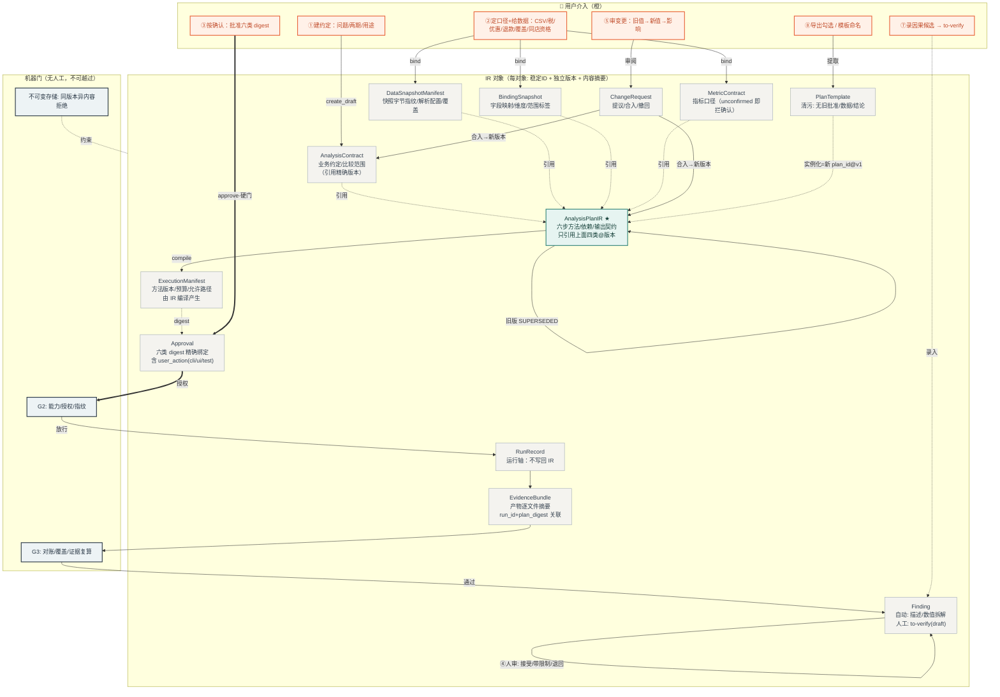
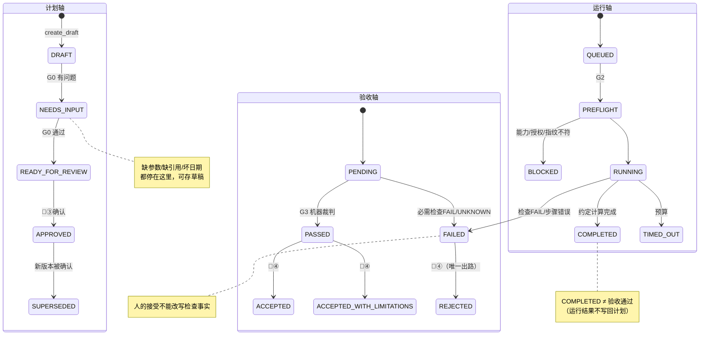

# IR 流程图与用户介入点（P0 实现版）

> 视角：**IR（Analysis Plan IR 及其 12 类对象）** 的产生、引用、版本化与消费——上一份文档（workflow-and-human-gates.md）讲"流水线怎么跑"，本文讲"数据对象怎么流转、人卡在哪条边上"。
> IR 铁律（proposal 7）：对象版本不可变（同版本同内容幂等、异内容拒绝）；引用精确版本、禁 `latest`；运行结果与检查记录**不写回**计划；文件路径只在存储层解析。

## 一、IR 对象流转图（谁产生 → 被谁引用 → 谁消费）

## 二、三条状态轴（分离保存，互不覆盖）

## 三、IR 迁移上的人工介入点

| IR 迁移 | 触发者 | 用户动作 | 不动作的后果 |
|---|---|---|---|
| 参数 → `AnalysisContract` | 用户① | 确认问题/两期/用途 | 契约缺口 → 计划停 `NEEDS_INPUT` |
| `MetricContract` 口径 | 用户② | 三口径选实值 | `unconfirmed` → G1 拒绝确认（T03） |
| → `BindingSnapshot`/`DataSnapshotManifest` | 用户② | 给数据+覆盖清单+可选同店资格；警告知悉 | 阻断项：绑定失败；警告项：确认时必须 ack |
| `AnalysisPlanIR: DRAFT→APPROVED` | **用户③（唯一路径）** | approve 六类 digest | 无授权 → 运行轴 `BLOCKED(not-authorized)` |
| 同 plan_id 实质变更 → 新版本 | 用户⑤ 审 CR | 看旧值/新值/影响 → 合入或撤回 | 新版本无确认（digest 复算自动失效旧授权） |
| 运行轴/验收轴 | 机器 | 不介入（预算/超时/门禁自动） | — |
| `Finding` 人审（ReviewRecord） | 用户④ | 接受/带限制/退回 | 验证 FAIL/UNKNOWN → 只能 REJECTED 或改计划 |
| → `to-verify` Finding | 用户⑦ | 录入因果候选 | 不录则不存在；自动发现永不产生因果类型 |
| → `PlanTemplate` | 用户⑧ | 命名提取（清污自动强制） | 模板只带方法/参数槽/适用条件 |
| 模板 → 新 `AnalysisPlanIR` | 用户⑥ | 下周期重新绑定 | 新 plan_id@v1，一切从 NEEDS_INPUT 重新走 |

## 四、与"模型工厂"视图的差异（一句话）

工厂视图回答"**流程怎么跑**"；IR 视图回答"**数据怎么变**"：每个对象只在明确的生产者手里诞生、只被精确版本引用、内容一变旧确认即失效——用户介入点从"流程节点"落到"**对象迁移的边**"上，其中只有 `AnalysisPlanIR → APPROVED` 一条边**必须**由人走出，其余介入点要么在对象诞生前（①②），要么在对象诞生后（④⑤⑥⑦⑧）。
