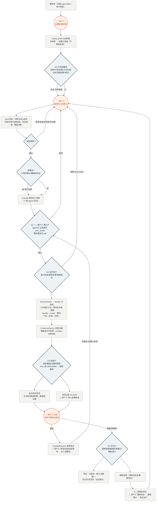

# 分析工厂流程与用户介入点（P0 实现版）

> 对象：Analysis Plan Studio P0（仓库当前实现）。
> "工厂"指一条分析的生产流水线：模板 → 草稿 → 绑定 → 确认 → 受限执行 → 证据验收 → 模板沉淀，产出可复用的分析模型与带证据的结果。
> 人的角色不是旁观者：**四道硬门（G0/G1/G3/G4）中三道必须人工动作才能推进**，机器与服务自身永不生成确认。

## 一、流程图（含人工门）

## 二、用户介入点清单

| # | 介入点 | 用户动作 | 性质 | 不过的后果 | 实现位置 |
|---|---|---|---|---|---|
| ① | 建计划 | 选模板、填问题/用途/两期 | 必填项硬性，其余可后补 | 缺项进"待确认"，计划停在 NEEDS_INPUT | `PlanService.create_draft` |
| ② | 数据与口径 | 提供 CSV、三个口径（税/优惠/退款）、覆盖清单日期、可选门店资格清单 | 阻断项必须修；警告项需知悉 | 缺字段/混合币种/坏日期直接阻断绑定；口径未确认、覆盖未验证记为警告带入确认门 | `LocalContext.bind` |
| ③ | **确认门（核心硬门）** | 对六类 digest 的精确绑定按下"确认" | **硬门**：服务自身永不生成确认（G2 决议） | 无有效确认 → 运行被 G2 阻断（not-authorized） | `ApprovalService.approve` |
| ④ | 验收 | 接受 / 带限制接受 / 退回 | **硬门**：三轴分离（运行完成≠验证通过≠用户接受） | 验证 FAIL/UNKNOWN 时只能退回或改计划；退回后走变更 | `EvidenceService.accept` |
| ⑤ | 变更审阅 | 看 diff（旧值/新值/影响）→ 合入或撤回 | 硬门：实质变更必产生新版本并重新过确认门 | 旧确认对任何内容变化自动失效（digest 复算） | `ChangeService` + UI 两步 |
| ⑥ | 模板复用 | 提取模板（人工命名）、下周期实例化 | 半硬门：模板自动清污，但新任务必须重新绑定+重新确认 | —（复用复制的是方法，不是结论资格） | `TemplateService` |
| ⑦ | 待验证区 | 录入因果候选（如"断货导致下降"） | 自愿；**不录就不存在**——自动发现永不产生因果结论 | 候选留在审查区，获证据前不构成结论 | `add_to_verify` |
| ⑧ | 导出确认 | 交付包/复现包需显式勾选包含结果/数据 | 硬门：数据外发必须显式 | 交接包默认无原始数据、无绝对路径 | `ExportService` |
| ⑨ | 运行监督 | 启动运行；（取消为已披露限制） | 半硬门：预算/超时机器强制，人只观察 | 超时/越界/指纹不符机器自动阻断 | `RunController` |

## 三、机器强制、无需人介入的关卡（对照）

- **G2 运行前门**：能力版本不匹配、授权缺失、快照指纹不符 → 机器直接 BLOCKED，人无从越过。
- **Worker 安全边界**：路径白名单、RLIMIT、无网络、白名单方法——用户与 Agent 都无法注入自由代码（T15）。
- **G3 验收检查**：对账精确到分、产物摘要复算、跨运行证据关联——机器裁判，人的接受不能改写检查事实。
- **内容变化失效**：六类对象任一内容变化，旧确认自动失效（复算 digest），无需人记得去作废。

## 四、一句话总结

这条流水线上**机器负责"算"与"核"，人只在四个位置出手：填约定（①②）、按确认（③）、做验收（④）、审变更（⑤）**；其余警告知悉、待验证录入、模板与导出是可选的参与点。任何一步用户不动作，流程就停在对应状态（NEEDS_INPUT / BLOCKED / PENDING），绝不静默降级放行。
